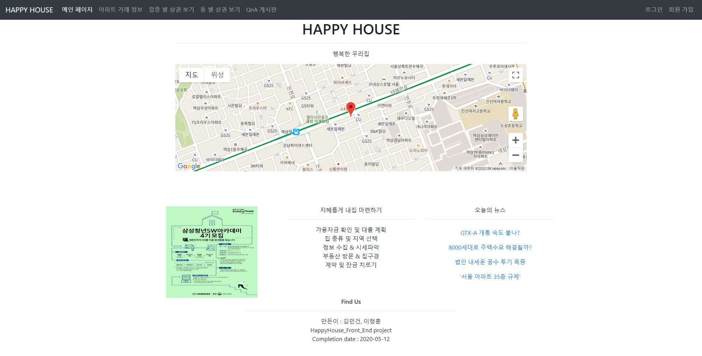
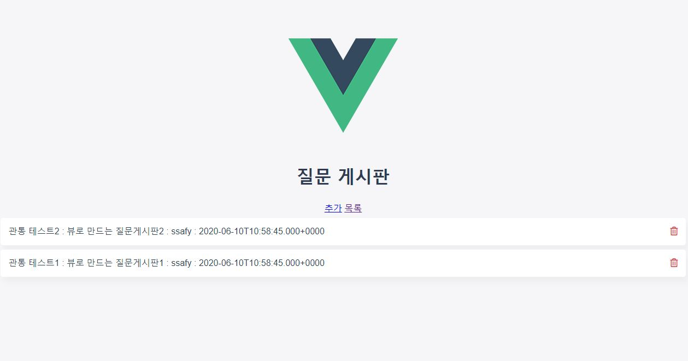
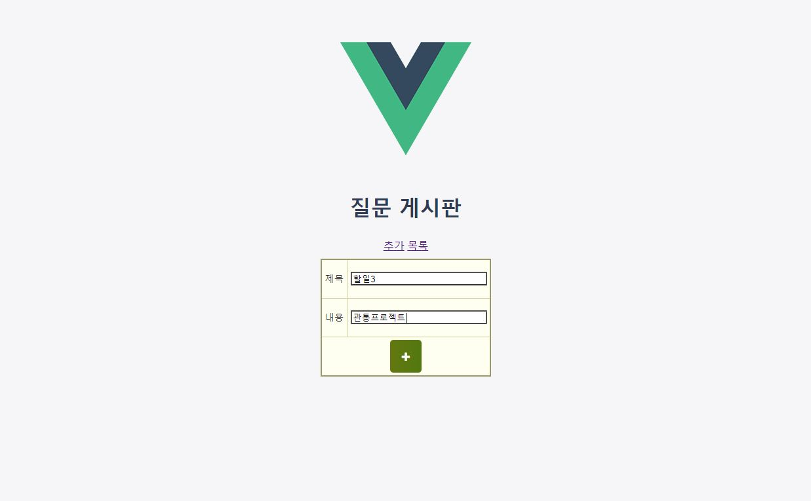
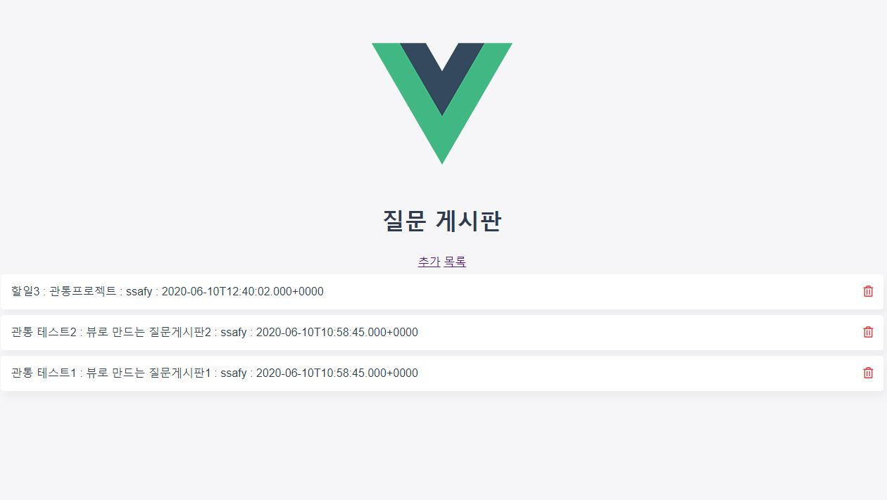
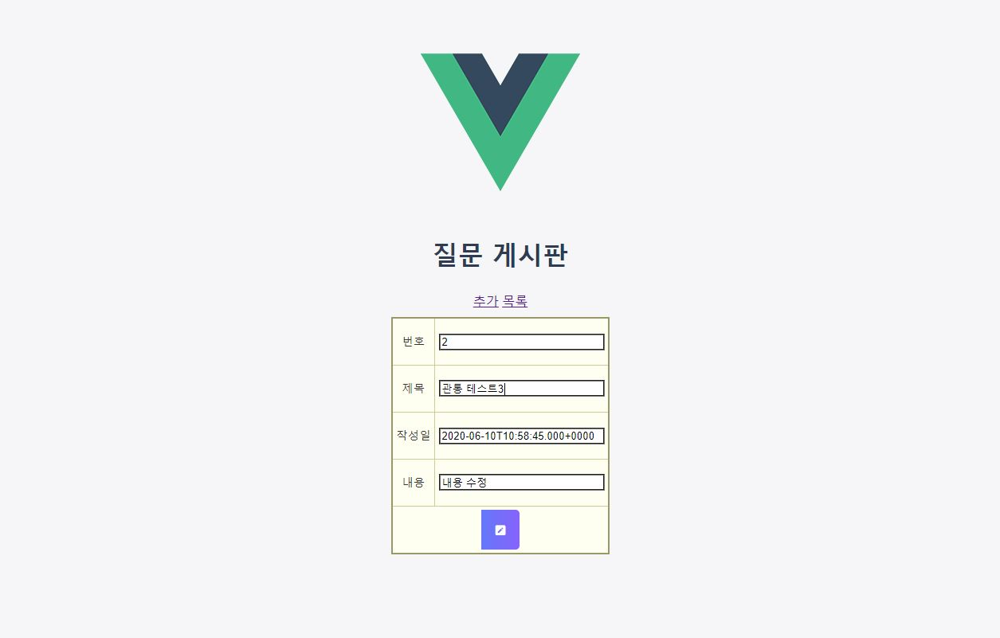
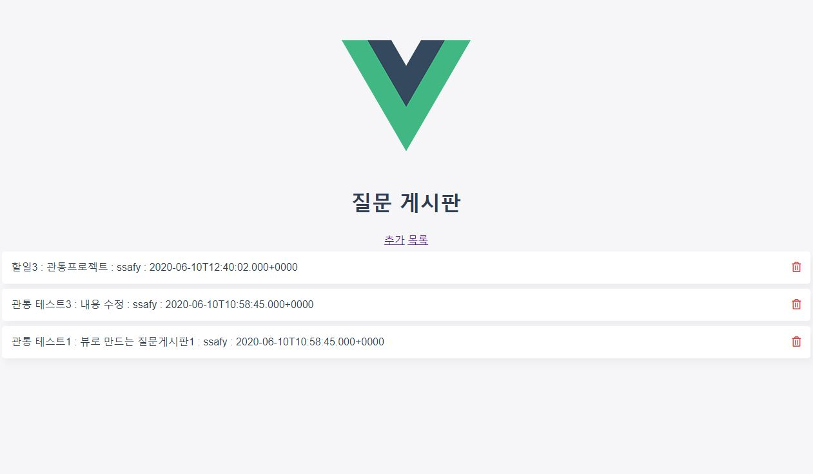
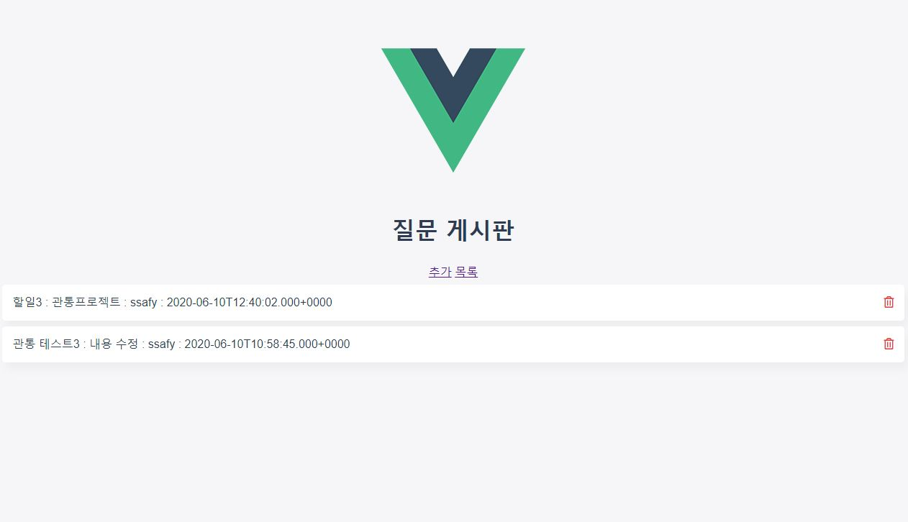
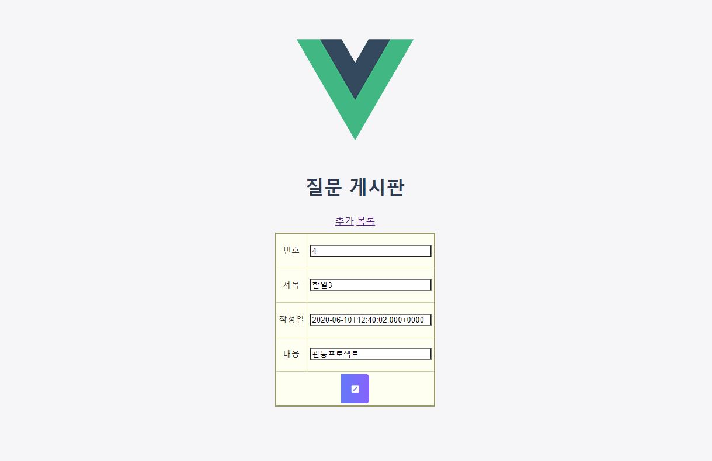

## 목표
- 웹 아키텍처를 이해하고 활용할 수 있다.
- Vue.js를 활용하여 SPA 웹 서버를 구축할 수 있다.
- MVC 아키텍처를 활용하여 확장성과 유지보수성 좋은 웹 서버를 구축할 수 있다. 

## 구현 기본(필수) 기능
1) 메뉴에 QnA 게시판 추가 
2) 게시글 목록 서비스 
3) 게시글 입력 서비스 
4) 게시글 수정, 삭제, 상세 검색 서비스 

## 참고 화면

## 1. 메뉴에 QnA 게시판 추가

## 2. 게시글 목록 서비스

  

#### 3. 게시글 입력 서비스

  
  

#### 4. 게시글 수정, 삭제, 상세 검색 서비스

4.1 게시글 수정 서비스  
  
  

4.2 게시글 삭제 서비스(할일1 휴지통 클릭 후)  
  

4.3 게시글 상세 검색 서비스  
  

